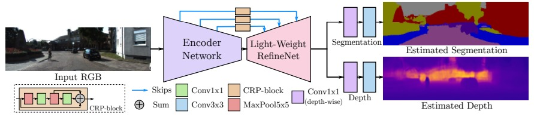

# Multi-Task-Learning

This research shows how to simultaneously train and execute the tasks of semantic segmentation and depth estimation using a multi-task deep learning algorithm (like [HydraNet](https://openaccess.thecvf.com/content_cvpr_2018/papers/Mullapudi_HydraNets_Specialized_Dynamic_CVPR_2018_paper.pdf)).

## Architecture

[Source](https://arxiv.org/pdf/1809.04766.pdf)

## Output

## Instructions

1. Download the NYU Depth V2 dataset from [here](https://cs.nyu.edu/~silberman/datasets/nyu_depth_v2.html) and change the path of the dataset in the code.  
2. Run `python train.py` to train the model.  
3. To run inference on the trained model, run `python inference.py` 

## References

This project is based on the paper "Real-Time Joint Semantic Segmentation and Depth Estimation Using Asymmetric Annotations". Some of the code has been adapted from the official [repository](https://github.com/DrSleep/multi-task-refinenet).
